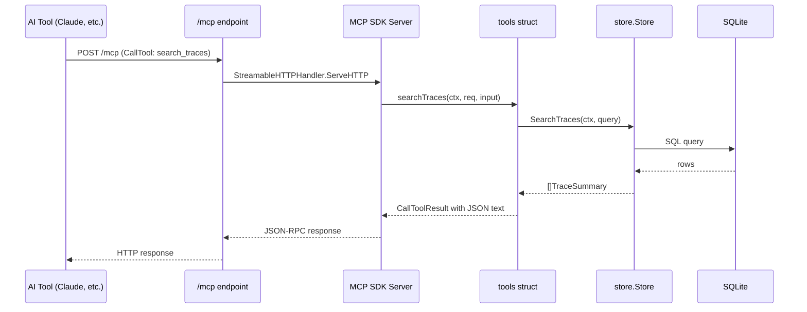

# System Components

## Package: `internal/mcp`

Single package containing the MCP server setup and tool handlers.

### Server Factory

**`New(s *store.Store, version string) http.Handler`**

Responsibility: Create the MCP server, register all tools, and return a Streamable HTTP handler.

- Creates `mcp.NewServer` with `Implementation{Name: "pocket-trace", Version: version}`
- Registers all 7 tools via `mcp.AddTool[In, any]`
- Returns `mcp.NewStreamableHTTPHandler` using a callback that returns the server:
  ```
  mcp.NewStreamableHTTPHandler(
      func(r *http.Request) *mcp.Server { return srv },
      &mcp.StreamableHTTPOptions{Stateless: true},
  )
  ```

The tool handler functions are unexported methods on a `tools` struct that holds `*store.Store`. This avoids closures and keeps handlers testable.

### Tools Struct

```
type tools struct {
    store *store.Store
}
```

Responsibility: Hold the store reference and provide tool handler methods. Each method has the signature `func(context.Context, *mcp.CallToolRequest, In) (*mcp.CallToolResult, any, error)` as required by `mcp.ToolHandlerFor[In, any]`.

Key methods:
- `listServices` -- delegates to `store.ListServices`
- `searchTraces` -- converts `SearchTracesInput` to `store.TraceQuery`, delegates to `store.SearchTraces`
- `getTrace` -- delegates to `store.GetTrace`, returns error if not found
- `getSpan` -- delegates to `store.GetSpan`, returns error if not found
- `findErrorTraces` -- compound: searches, filters for errors, fetches full traces. Returns partial results if some `GetTrace` calls fail.
- `getDependencies` -- converts `sinceHours` to `time.Time` via `time.Now().Add(-time.Duration(sinceHours) * time.Hour)`, delegates to `store.GetDependencies`
- `getStatus` -- delegates to `store.Stats`

### Integration in `internal/server/server.go`

The MCP handler is mounted in the existing `server.New()` function. It goes after `RegisterRoutes(app, h)` and before the SPA fallback. Since Fiber v3 runs on fasthttp (not net/http), the `http.Handler` must be bridged via `adaptor.HTTPHandler()`.

```
import "github.com/gofiber/fiber/v3/middleware/adaptor"

RegisterRoutes(app, h)

mcpHandler := mcpserver.New(s, h.Version)
app.All("/mcp", adaptor.HTTPHandler(mcpHandler))

if uiFS != nil && hasIndexHTML(uiFS) { ... }
```

Note: `s` and `h.Version` are both available in `server.New()`'s existing parameters. The adaptor is part of Fiber v3 (no new dependency). Verify during implementation that the adaptor does not strip or modify the request path in a way that breaks the SDK handler.

### Data Flow


